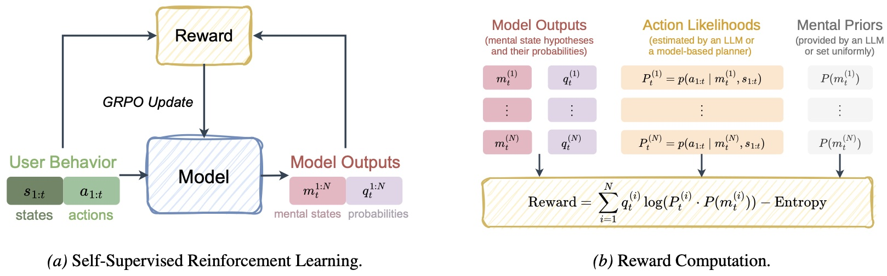

<div align="center">
  <h1 align="center">
    MindZero<!--
--><sup>
    
    <sup>
  </h1>

  <p><b>Learning Online Mental Reasoning With Zero Annotations</b></p>
</div>

## 💡 TL;DR

> **MindZero** is a self-supervised reinforcement learning framework that trains multimodal large language models (MLLMs) for efficient and robust online mental reasoning.

During training, the model is rewarded for generating mental state hypotheses that maximize the likelihood of observed actions estimated by a planner, similar to model-based ToM reasoning. This method thus eliminates the need for explicit mental state annotations. After training, MindZero internalizes model-based reasoning into fast single-pass inference.

Across challenging mental reasoning and AI assistance tasks, MindZero enhances MLLMs' intrinsic ToM ability and significantly outperforms model-based methods in both accuracy and efficiency.

<p align="center">
  
</p>

> **Highlights:** Small models & SOTA performance · Zero mental state annotations · Online inference with robust uncertainty updates over multiple hypotheses · Efficient reasoning suitable for real-time assistance


## 📝 Quick Start

Coming soon :)

## 📖 Citation

```
Coming soon :)
```
